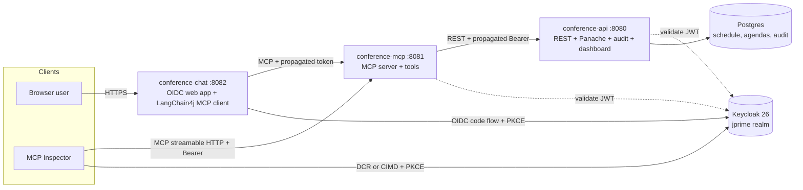
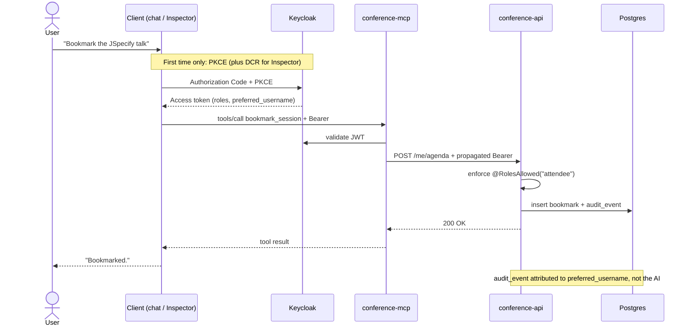

# Practical MCP Security in Action
### jPrime 2026 / Conference Companion / Demo backend

> "It wasn't the AI. It was me."
>
> Three demos, three tiers. All against the same Quarkus MCP server and the same audit log.

## Layout

| Path | What it is |
|------|------------|
| `conference-api/`   | Quarkus REST + Panache + Postgres. Owns the schedule, attendee agendas, ratings, and the audit log. Serves the live audit dashboard at `/audit-live`. |
| `conference-mcp/`   | Quarkus MCP server (streamable HTTP). Exposes tools to AI clients and propagates the user OAuth token to `conference-api`. |
| `conference-chat/`  | Quarkus chat client. OIDC web-app login, LangChain4j MCP client to `conference-mcp`, Qute-rendered shell. |
| `keycloak-realm.json` | Single shared realm export at the monorepo root. All three apps reference it via `../keycloak-realm.json`. |
| `SPEC.md`           | Original build spec for the demo (canonical reference). |
| `RUNBOOK.md`        | Stage-side runbook with the three-demo flow and the env vars to set. |

No Docker compose file: every backing service is auto-provisioned by **Quarkus Dev Services**.

## Architecture

Three Quarkus apps share one Keycloak realm. Clients authenticate against Keycloak (chat via OIDC code flow + PKCE, MCP Inspector via DCR or CIMD + PKCE), then call the MCP server with a Bearer token. The MCP server validates the token, then propagates it to `conference-api`, which enforces roles and writes the audit log.



The heart of the demo is token propagation: the same user token flows from the client, through the MCP tool call, into `conference-api`, where the action is authorized and audited under the user's identity, not the AI's.



## MCP endpoint authorization

The whole `/mcp` endpoint is gated at the HTTP layer: every request must carry a valid Bearer token whose realm roles include `attendee`. `conference-mcp` runs `quarkus-oidc` in `service` mode (it validates the JWT against the Keycloak JWKS, no client id or secret needed) and adds the `quarkus-mcp-server-oidc` extension, which turns authorization failures into the challenges the MCP authorization spec expects:

- **No token** returns `401` with a `WWW-Authenticate: Bearer ..., resource_metadata="..."` header. The `resource_metadata` URL is the RFC 9728 protected-resource document at `/.well-known/oauth-protected-resource`, and it is what drives an MCP client's discovery and OAuth flow.
- **A valid token without the `attendee` scope** returns `403` with `WWW-Authenticate: Bearer error="insufficient_scope", scope="attendee", resource_metadata="..."`, telling the client exactly which scope to request.

On top of the role check, `conference-mcp` validates the token **audience**: only tokens carrying `aud=conference-mcp` are accepted (`quarkus.oidc.token.audience`), as the MCP authorization spec requires of resource servers. Keycloak has no RFC 8707 resource-indicator support yet, so the audience comes from the realm's `attendee` client scope, which carries audience mappers for `conference-mcp` and `conference-api` (the officially documented Keycloak workaround). `conference-chat` has that scope by default; DCR and CIMD clients request `scope=attendee`, which is exactly what the challenge and the resource metadata advertise. A token from another client in the realm without that scope is rejected with a `401` even if its user has the role, closing the confused-deputy hole of accepting any realm token.

This is the endpoint-level gate. It is distinct from the step-up case in demo 3, where a missing MFA `acr` surfaces per tool as `insufficient_user_authentication`.

## Client registration: DCR vs CIMD

An AI client has to obtain an OAuth client identity before it can run PKCE. The demo shows both mechanisms the MCP authorization spec allows, against the same realm.

**Dynamic Client Registration (DCR)** has the client POST to a writeable registration endpoint and get back a generated `client_id`. To make this work for MCP Inspector, the realm clears four anonymous registration policies (documented in [`RUNBOOK.md`](RUNBOOK.md)). The talking point: "the AI got a token" is not "the AI got a useful token", every scope, role, and claim has to be consciously engineered back in.

**Client ID Metadata Documents (CIMD)**, the spec-preferred default since the MCP 2025-11-25 spec (SEP-991), drop the registration step entirely. The `client_id` is an HTTPS URL, and Keycloak fetches the client metadata document at that URL. The demo serves one at `conference-mcp/.../META-INF/resources/cimd/mcp-inspector.json`, enabled through Keycloak's experimental `cimd` feature (`quarkus.keycloak.devservices.features=cimd`).

| | DCR | CIMD |
|--|-----|------|
| Client identity | Generated `client_id` from a registration call | An HTTPS URL that is the `client_id` |
| Server state | A stored registration record per client | None, the document is fetched on demand |
| Registration endpoint | Writeable, must be opened and policed | None |
| Realm setup for this demo | Four anonymous policies cleared | One experimental feature flag enabled |
| Spec status | Supported | Preferred default since 2025-11-25 |

## Run

```bash
# Terminal 1 - conference-api on :8080
cd conference-api && ./mvnw quarkus:dev

# Terminal 2 - conference-mcp on :8081
cd conference-mcp && ./mvnw quarkus:dev

# Terminal 3 - conference-chat on :8082
cd conference-chat && ./mvnw quarkus:dev
```

On first start Dev Services boots:

- a **Postgres 16** container for `conference-api` (schema owned by Hibernate via `drop-and-create`, auto-seeded with the schedule and demo data)
- a **Keycloak 26** container with the `jprime` realm pre-imported, shared between all three apps via `service-name=jprime-keycloak`

The realm export lives once at the monorepo root (`./keycloak-realm.json`). All three apps reference it via `quarkus.keycloak.devservices.realm-path=../keycloak-realm.json`.

Dev UI for each app lives at `http://localhost:8080/q/dev/`, `http://localhost:8081/q/dev/`, and `http://localhost:8082/q/dev/`.

Playwright end-to-end tests live inside `conference-chat`: run them with `cd conference-chat && ./mvnw test`.

## Demo dashboard

`http://localhost:8080/audit-live/` shows the second-screen view used in demos 2 and 3. The styling matches the talk deck: dark surface, brand blue for normal events, amber for step-up tools, red for destructive actions, mono font for `audit_event` rows.

Open the page on a secondary monitor and run the demos. New events appear within two seconds of every tool call.

## Demos

See [`RUNBOOK.md`](RUNBOOK.md) for the moment-by-moment script of the three live demos:

1. **Public** browse the schedule. PKCE + Authorization Code Flow, with client identity via DCR and via CIMD.
2. **Personal** agenda, ratings, conflicts. Token propagation, full audit.
3. **Sensitive** speaker-only tools with step-up MFA. Server-driven challenge.

## Brand palette (lifted from the deck)

| Role | Hex | Where it shows up |
|------|-----|-------------------|
| Background    | `#0E1116` | Audit dashboard surface |
| Surface       | `#171B22` | Cards, top bar |
| Border        | `#2A313C` | Card outlines |
| Primary text  | `#F5F7FA` | Headings, key values |
| Muted text    | `#9AA4B2` | Subtitles, field labels |
| Brand         | `#0088D3` | Normal actions, links, accents |
| Amber         | `#F2A65A` | Step-up / sensitive actions, identity highlights |
| Body type     | Calibri / system sans | Headings, prose |
| Mono type     | Consolas / JetBrains Mono | `audit_event`, identifiers |

## Conventions

- No em dashes anywhere in code, comments, or docs (Lunatech house style).
- Tests run against Quarkus Dev Services (Testcontainers under the hood); no manual infra needed for `mvn test`.
- Hibernate owns the schema (`drop-and-create` in dev/test). No Flyway.
